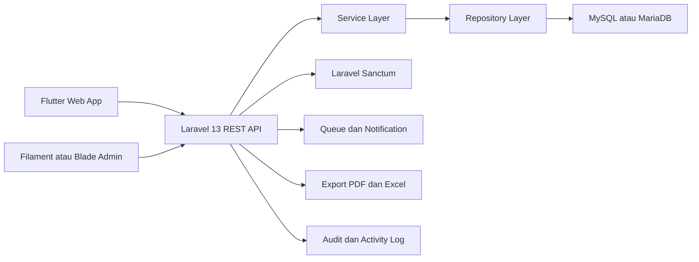
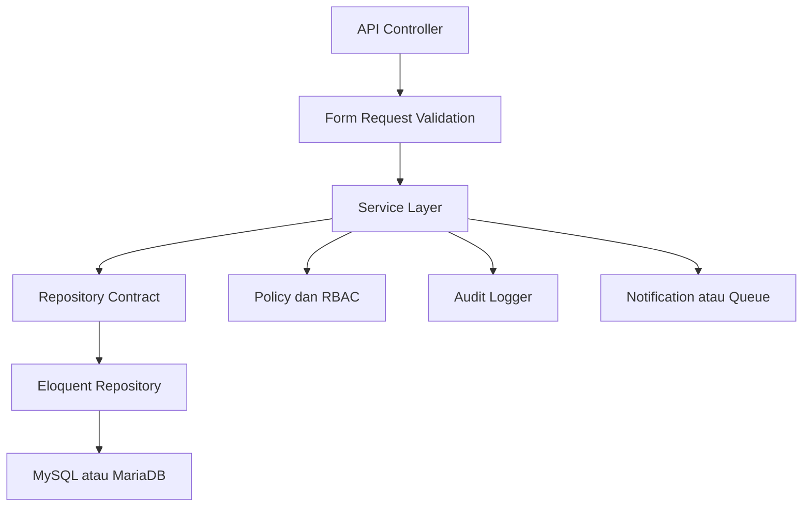
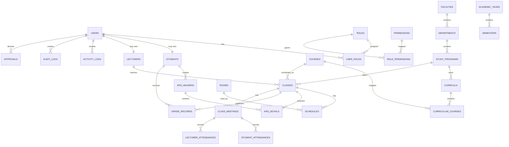

## 1. Desain Arsitektur


## 2. Deskripsi Teknologi
- Frontend pengguna: Flutter 3 Web + Material Design 3 + Riverpod + Dio + go_router.
- Dashboard admin: Laravel 13 + Filament 3 sebagai pilihan utama, Blade sebagai fallback untuk layar khusus.
- Backend API: Laravel 13 + REST API + Form Request Validation + API Resource.
- Otentikasi: Laravel Sanctum untuk SPA dan panel admin, JWT opsional untuk integrasi eksternal.
- Database: MySQL atau MariaDB yang dikelola lewat phpMyAdmin, dengan desain minimal 3NF.
- File export: Laravel Excel untuk Excel dan Dompdf atau Snappy untuk PDF.
- Audit: tabel audit log dan activity log kustom berbasis Eloquent event dan middleware.
- DevOps readiness: environment variable, queue worker, scheduler, storage publik, cache, dan logging terstruktur.

## 3. Struktur Solusi
### 3.1 Struktur Repositori
| Folder | Tujuan |
|--------|--------|
| `frontend/siat_web/` | Flutter Web untuk mahasiswa, dosen, pimpinan |
| `backend/siat_api/` | Laravel 13 REST API, admin panel, auth, export |
| `.trae/documents/` | PRD, arsitektur teknis, desain halaman |
| `database/schema/` | referensi ERD, DDL, dan dokumentasi skema |

### 3.2 Struktur Frontend Flutter
| Folder | Tujuan |
|--------|--------|
| `lib/core/` | konstanta, error, theme, router, network, shared helpers |
| `lib/shared/` | widget bersama, layout, state global |
| `lib/features/auth/` | login, forgot password, reset password, session |
| `lib/features/dashboard/` | dashboard per peran |
| `lib/features/master_data/` | modul referensi akademik |
| `lib/features/academic/` | KRS, KHS, transkrip, presensi, jadwal |
| `lib/features/lecturer/` | nilai, presensi mengajar, rekap |
| `lib/features/reporting/` | laporan dan export trigger |
| `lib/features/profile/` | profile, change password, active sessions |

### 3.3 Struktur Backend Laravel
| Folder | Tujuan |
|--------|--------|
| `app/Http/Controllers/Api/V1/` | endpoint REST versi 1 |
| `app/Http/Requests/Api/V1/` | validasi request |
| `app/Http/Resources/Api/V1/` | normalisasi response |
| `app/Services/` | orchestration business logic |
| `app/Repositories/Contracts/` | interface repository |
| `app/Repositories/Eloquent/` | implementasi repository berbasis Eloquent |
| `app/Domain/` | aturan domain yang kompleks dan reusable |
| `app/Policies/` | kebijakan otorisasi |
| `app/Filament/` | admin panel Filament |
| `database/migrations/` | skema database |
| `database/seeders/` | role, permission, akun awal, referensi dasar |

## 4. Definisi Rute
### 4.1 Rute Flutter Web
| Route | Tujuan |
|-------|--------|
| `/login` | login pengguna |
| `/forgot-password` | permintaan reset password |
| `/reset-password` | form reset password |
| `/dashboard` | dashboard dinamis berbasis role |
| `/academic/krs` | KRS online |
| `/academic/khs` | KHS mahasiswa |
| `/academic/transcript` | transkrip nilai |
| `/academic/schedule` | jadwal kuliah |
| `/academic/attendance` | presensi mahasiswa |
| `/lecturer/classes` | daftar kelas dosen |
| `/lecturer/grades/:classId` | input dan finalisasi nilai |
| `/profile` | profil, password, session management |
| `/reports` | laporan dan ekspor |

### 4.2 Rute Admin Laravel
| Route | Tujuan |
|-------|--------|
| `/admin` | dashboard admin |
| `/admin/users` | manajemen user |
| `/admin/roles` | manajemen role |
| `/admin/permissions` | manajemen permission |
| `/admin/students` | data mahasiswa |
| `/admin/lecturers` | data dosen |
| `/admin/programs` | data prodi, jurusan, fakultas |
| `/admin/courses` | data mata kuliah dan kurikulum |
| `/admin/classes` | data kelas dan jadwal |
| `/admin/approvals` | approval workflow |
| `/admin/announcements` | pengumuman |
| `/admin/reports` | laporan institusi |
| `/admin/audit-logs` | audit trail |

## 5. Definisi API
### 5.1 Standar Respons
```json
{
  "success": true,
  "message": "Data berhasil diambil",
  "data": {},
  "meta": {
    "page": 1,
    "per_page": 20,
    "total": 120
  },
  "errors": null
}
```

### 5.2 Endpoint Inti
| Method | Endpoint | Tujuan |
|--------|----------|--------|
| POST | `/api/v1/auth/login` | login dan membuat session Sanctum |
| POST | `/api/v1/auth/logout` | logout session aktif |
| POST | `/api/v1/auth/forgot-password` | kirim token reset |
| POST | `/api/v1/auth/reset-password` | reset password |
| POST | `/api/v1/auth/change-password` | ubah password pengguna aktif |
| GET | `/api/v1/me` | data user aktif, role, permission, profil ringkas |
| GET | `/api/v1/dashboard` | KPI per role |
| GET | `/api/v1/students` | list mahasiswa |
| POST | `/api/v1/students` | tambah mahasiswa |
| GET | `/api/v1/lecturers` | list dosen |
| GET | `/api/v1/courses` | list mata kuliah |
| GET | `/api/v1/classes` | list kelas |
| GET | `/api/v1/schedules` | list jadwal |
| GET | `/api/v1/krs/current` | daftar KRS semester aktif |
| POST | `/api/v1/krs/entries` | tambah mata kuliah ke draft KRS |
| POST | `/api/v1/krs/submit` | submit KRS |
| GET | `/api/v1/khs` | hasil studi mahasiswa |
| GET | `/api/v1/transcripts` | transkrip nilai |
| GET | `/api/v1/attendance/student` | presensi mahasiswa |
| GET | `/api/v1/lecturer/classes` | kelas yang diampu dosen |
| GET | `/api/v1/lecturer/classes/{class}/grades` | daftar nilai mahasiswa per kelas |
| PUT | `/api/v1/lecturer/classes/{class}/grades` | simpan draft nilai |
| POST | `/api/v1/lecturer/classes/{class}/grades/finalize` | finalisasi nilai |
| GET | `/api/v1/approvals` | antrian approval |
| POST | `/api/v1/approvals/{approval}/decision` | approve, reject, needs_revision |
| GET | `/api/v1/reports/{type}` | generate data laporan |
| GET | `/api/v1/audit-logs` | daftar audit trail |

### 5.3 Kontrak Tipe Inti
```ts
type ApiResponse<T> = {
  success: boolean;
  message: string;
  data: T;
  meta?: {
    page?: number;
    per_page?: number;
    total?: number;
  };
  errors?: Record<string, string[] | string> | null;
};

type AuthUser = {
  id: string;
  name: string;
  email: string;
  roles: string[];
  permissions: string[];
};

type DashboardSummary = {
  role: "student" | "lecturer" | "admin" | "leader";
  cards: Array<{ key: string; label: string; value: string | number; trend?: string }>;
  charts: Array<{ key: string; label: string; points: number[] }>;
  todos: Array<{ id: string; title: string; status: string; due_at?: string }>;
};
```

## 6. Diagram Arsitektur Server


## 7. Model Data
### 7.1 Definisi Model Data


### 7.2 Entitas Inti
| Domain | Entitas |
|--------|---------|
| Identity | users, roles, permissions, user_roles, role_permissions, personal_access_tokens |
| People | students, lecturers |
| Academic Reference | faculties, departments, study_programs, curricula, courses, academic_years, semesters, rooms |
| Teaching Operation | classes, schedules, class_meetings |
| Study Transaction | krs_headers, krs_details, grade_records, student_attendances, lecturer_attendances |
| Governance | announcements, academic_calendars, academic_letters, approvals, verification_records |
| Audit | activity_logs, audit_logs |

### 7.3 DDL Ringkas
```sql
create table users (
    id uuid primary key,
    name varchar(120) not null,
    email varchar(120) not null unique,
    password varchar(255) not null,
    is_active boolean not null default true,
    last_login_at timestamp null,
    created_at timestamp not null,
    updated_at timestamp not null
);

create table roles (
    id uuid primary key,
    code varchar(50) not null unique,
    name varchar(120) not null,
    created_at timestamp not null,
    updated_at timestamp not null
);

create table permissions (
    id uuid primary key,
    code varchar(100) not null unique,
    name varchar(150) not null,
    created_at timestamp not null,
    updated_at timestamp not null
);

create table students (
    id uuid primary key,
    user_id uuid null references users(id),
    study_program_id uuid not null references study_programs(id),
    nim varchar(30) not null unique,
    name varchar(120) not null,
    academic_status varchar(30) not null,
    enrollment_year smallint not null,
    created_at timestamp not null,
    updated_at timestamp not null
);

create index idx_students_program_status on students(study_program_id, academic_status);

create table grade_records (
    id uuid primary key,
    class_id uuid not null references classes(id),
    student_id uuid not null references students(id),
    assignment_score numeric(5,2) null,
    mid_score numeric(5,2) null,
    final_score numeric(5,2) null,
    final_numeric numeric(5,2) null,
    final_letter varchar(2) null,
    status varchar(20) not null default 'draft',
    finalized_at timestamp null,
    created_at timestamp not null,
    updated_at timestamp not null
);

create index idx_grade_records_class_student on grade_records(class_id, student_id);

create table audit_logs (
    id bigserial primary key,
    user_id uuid null references users(id),
    module varchar(80) not null,
    action varchar(80) not null,
    auditable_type varchar(120) not null,
    auditable_id varchar(64) not null,
    old_values jsonb null,
    new_values jsonb null,
    ip_address varchar(64) null,
    user_agent text null,
    created_at timestamp not null
);
```

## 8. Keamanan dan Tata Kelola
- Sanctum untuk session-based authentication SPA dan panel admin.
- Form Request Validation di seluruh endpoint mutasi.
- Middleware rate limiting untuk login, forgot password, dan endpoint sensitif.
- Policy dan Gate untuk RBAC pada level modul, aksi, dan cakupan data.
- Proteksi CSRF pada panel admin dan endpoint berbasis cookie session.
- Escaping output dan sanitasi input untuk mitigasi XSS.
- Query parameter tervalidasi untuk mencegah SQL injection melalui filter dinamis.
- Activity log untuk aksi operasional, audit log untuk perubahan data sensitif.

## 9. Strategi Pengembangan Bertahap
### Fase 1
- Auth, RBAC, dashboard dasar, master data inti, jadwal, KRS, input nilai awal, audit log.

### Fase 2
- KHS, transkrip, surat akademik, approval workflow lengkap, verifikasi data, laporan lanjutan, ekspor.

### Fase 3
- Dashboard pimpinan lanjutan, integrasi eksternal, notifikasi, optimasi performa, insight akademik.

## 10. Strategi Testing
- Laravel Feature Test untuk auth, RBAC, API, dan approval workflow.
- Laravel Unit Test untuk service dan rule akademik seperti batas SKS, IPS, finalisasi nilai.
- Flutter Widget Test untuk halaman login, dashboard, KRS, dan input nilai.
- Flutter Integration Test untuk login, submit KRS, dan finalisasi nilai.
- Uji query dan indeks MySQL atau MariaDB untuk skenario data besar.
