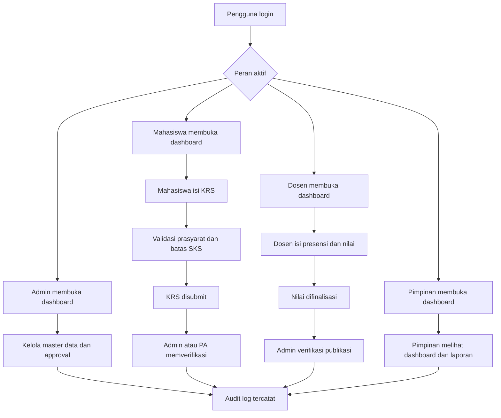

## 1. Gambaran Produk
SIAT adalah Sistem Informasi Akademik Terpadu berbasis web untuk perguruan tinggi yang menyatukan layanan akademik, administrasi, pelaporan, dan audit dalam satu platform modern.

- Produk menyelesaikan fragmentasi data akademik, keterlambatan layanan, dan rendahnya visibilitas proses lintas unit dengan pendekatan portal terintegrasi dan data real-time.
- Nilai utama produk adalah digitalisasi layanan akademik inti, transparansi proses, percepatan pengambilan keputusan, dan penguatan tata kelola institusi.

## 2. Fitur Inti

### 2.1 Peran Pengguna
| Peran | Metode Akses | Hak Akses Inti |
|------|---------------|----------------|
| Super Admin | Login akun institusi | Kelola user, role, permission, konfigurasi sistem, audit |
| Admin Akademik | Login akun institusi | Kelola master data, jadwal, approval, verifikasi, laporan |
| Dosen | Login akun institusi | Lihat jadwal mengajar, isi presensi, input dan finalisasi nilai |
| Mahasiswa | Login akun institusi | KRS online, lihat jadwal, KHS, transkrip, presensi, status akademik |
| Pimpinan | Login akun institusi | Dashboard strategis, analitik akademik, laporan dan monitoring SLA |

### 2.2 Modul Fitur
1. **Autentikasi dan Otorisasi**: login, logout, forgot password, reset password, change password, multi-role, session management, RBAC.
2. **Dashboard Per Peran**: statistik operasional, akademik, tindakan prioritas, grafik, dan notifikasi.
3. **Master Data Akademik**: mahasiswa, dosen, fakultas, jurusan, program studi, kurikulum, mata kuliah, semester, tahun akademik, ruangan, kelas, jadwal.
4. **Akademik Mahasiswa**: KRS, KHS, transkrip nilai, jadwal kuliah, presensi, IP, IPK, status akademik.
5. **Manajemen Dosen**: jadwal mengajar, beban mengajar, presensi mengajar, input nilai, rekap perkuliahan.
6. **Administrasi Akademik**: pengumuman, kalender akademik, surat akademik, verifikasi data, approval workflow.
7. **Laporan dan Ekspor**: laporan mahasiswa, dosen, presensi, nilai, akademik, ekspor PDF, ekspor Excel.
8. **Audit dan Tata Kelola**: activity log, audit log, permission management, role management, jejak perubahan data.

### 2.3 Detail Halaman
| Nama Halaman | Modul | Deskripsi Fitur |
|--------------|-------|-----------------|
| Login | Autentikasi | Form login, validasi, status akun, lupa password |
| Reset Password | Autentikasi | Token reset, perubahan password baru, validasi keamanan |
| Dashboard Mahasiswa | Dashboard | KPI akademik, jadwal hari ini, status KRS, notifikasi |
| Dashboard Dosen | Dashboard | Kelas aktif, progres penilaian, presensi mengajar, agenda |
| Dashboard Admin | Dashboard | antrian verifikasi, approval, kesehatan data, statistik operasional |
| Dashboard Pimpinan | Dashboard | KPI institusi, progres KRS, kepatuhan nilai, SLA proses |
| Data Mahasiswa | Master Data | CRUD, import, filter, status aktif, riwayat perubahan |
| Data Dosen | Master Data | CRUD, filter, beban mengajar, relasi user |
| Referensi Akademik | Master Data | fakultas, jurusan, prodi, kurikulum, semester, tahun akademik |
| Mata Kuliah dan Kelas | Master Data | mata kuliah, kelas, kapasitas, dosen pengampu |
| Jadwal Kuliah | Akademik | manajemen jadwal, deteksi konflik ruang dan dosen |
| KRS Online | Akademik | pilih mata kuliah, validasi prasyarat, validasi batas SKS, submit |
| KHS Mahasiswa | Akademik | hasil studi per semester, IPS, status finalisasi |
| Transkrip Nilai | Akademik | nilai final kumulatif, IPK, aturan pengulangan |
| Presensi Mahasiswa | Akademik | presensi per pertemuan, rekap hadir, izin, sakit, alfa |
| Workspace Dosen | Dosen | input komponen nilai, draft, finalisasi, kirim verifikasi |
| Rekap Mengajar | Dosen | daftar kelas, total pertemuan, presensi mengajar |
| Pengumuman | Administrasi | draft, review, publish, arsip |
| Kalender Akademik | Administrasi | periode KRS, UTS, UAS, libur, deadline akademik |
| Surat Akademik | Administrasi | pengajuan, verifikasi, approval, status dokumen |
| Verifikasi Data | Administrasi | bandingkan data lama-baru, cek bukti, approve atau tolak |
| Approval Queue | Administrasi | SLA, prioritas, pemilik antrian, catatan keputusan |
| Laporan | Laporan | filter, sorting, searching, generate PDF/Excel |
| Audit Trail | Audit | jejak aktivitas kritis, filter pelaku, objek, waktu, sumber aksi |

## 3. Proses Inti
Mahasiswa login, melihat status semester aktif, menyusun KRS, dan mengajukan KRS untuk validasi. Dosen login, memantau kelas, mengisi presensi, menginput nilai, lalu memfinalisasi hasil studi. Admin akademik memverifikasi perubahan data, membuka periode, mengelola master data, serta memproses approval penting. Pimpinan memantau dashboard agregat dan laporan strategis tanpa mengakses detail pribadi yang tidak berizin.

## 4. Desain Antarmuka
### 4.1 Gaya Desain
- Warna utama: biru institusional gelap, biru terang untuk aksi utama, putih dan abu netral untuk data padat.
- Warna sekunder: hijau untuk status berhasil, kuning untuk peringatan, merah untuk risiko dan penolakan.
- Gaya tombol: rounded modern, elevasi halus, state aktif jelas.
- Tipografi: sans-serif modern untuk UI data-intensive, hierarki tegas untuk dashboard dan form.
- Tata letak: desktop-first, sidebar kiri untuk navigasi modul, topbar untuk konteks peran, kartu statistik, tabel padat, panel detail.
- Gaya ikon: outline modern, konsisten di seluruh modul.

### 4.2 Gambaran Desain Halaman
| Nama Halaman | Modul | Elemen UI |
|--------------|-------|-----------|
| Login | Autentikasi | hero institusional, form fokus tunggal, bantuan keamanan |
| Dashboard | KPI dan monitoring | kartu statistik, grafik, quick action, feed aktivitas |
| Master Data | CRUD dan validasi | tabel terfilter, drawer detail, import wizard |
| KRS Online | Akademik | daftar mata kuliah, keranjang KRS, indikator SKS, status approval |
| Input Nilai | Dosen | tabel mahasiswa, komponen nilai, status draft-final |
| Approval Queue | Admin | daftar prioritas, badge SLA, panel pembanding data |
| Laporan | Pelaporan | filter panel, tabel hasil, tombol ekspor |
| Audit Trail | Tata kelola | tabel log, filter lanjutan, drawer detail perubahan |

### 4.3 Responsivitas
- Pendekatan desktop-first untuk kebutuhan operasional kampus.
- Tablet didukung penuh untuk dashboard, approval, dan monitoring.
- Tabel besar menggunakan sticky header, horizontal scroll terkendali, dan panel filter collapsible.

## 5. Integrasi SDGs
### SDG 4 - Quality Education
- Digitalisasi KRS, KHS, transkrip, nilai, dan presensi.
- Akses informasi akademik yang mudah dan cepat.
- Monitoring perkembangan belajar mahasiswa secara real-time.

### SDG 9 - Industry, Innovation and Infrastructure
- Arsitektur API-first yang siap integrasi.
- Platform modular dan scalable untuk pertumbuhan institusi.
- Dukungan pengembangan berkelanjutan melalui pemisahan domain dan service.

### SDG 16 - Peace, Justice and Strong Institutions
- Audit trail seluruh aktivitas penting.
- RBAC granular untuk akses yang terkontrol.
- Transparansi perubahan data dan proses approval.

## 6. Target Kualitas
- UI/UX modern dan profesional untuk institusi pendidikan tinggi.
- Responsif di desktop dan tablet.
- Aman, modular, mudah dipelihara, dan mudah dikembangkan.
- Mampu melayani institusi dengan puluhan ribu mahasiswa melalui optimasi query, cache, dan pagination.
- Dokumentasi API lengkap dan konsisten dengan kontrak respons standar.
